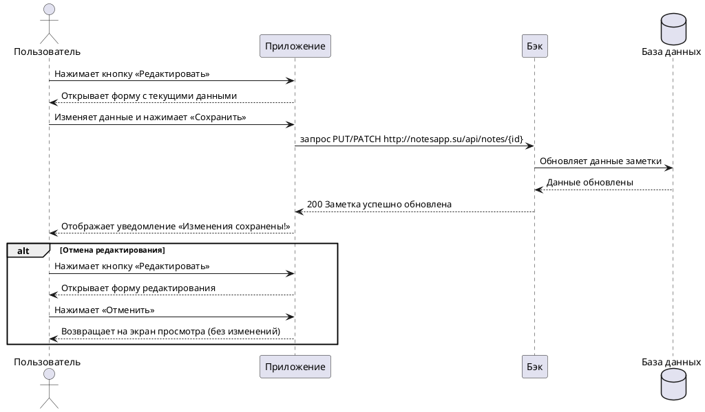

---
tags:
  - portfolio
  - manual
---

# Пользовательский сценарий «Редактирование заметки»

### Действующие лица:

1. Пользователь
2. Приложение
3. Бэк
4. База данных

### Предварительные условия

Пользователь должен находиться на экране просмотра конкретной заметки.

### Выходные условия

Изменения в заметке сохранены в системе и отображаются пользователю.

### Основной сценарий

1. Пользователь нажимает кнопку **Редактировать**.
2. Приложение открывает окно с формой редактирования, предзаполненной текущими данными заметки.
3. Пользователь вносит изменения в текст или заголовок заметки.
4. Пользователь нажимает кнопку **Сохранить**.
5. Приложение отправляет запрос Бэку на обновление данных  `PUT http://notesapp.su/api/notes/{id}`.
6. Бэк обновляет данные заметки в Базе данных.
7. Бэк возвращает Приложению ответ 200 «Заметка успешно обновлена».
8. Приложение открывает пользователю экран просмотра с обновленным текстом и уведомлением «Изменения сохранены».

### Альтернативный сценарий

1. Пользователь нажимает кнопку **Редактировать**.
2. Приложение открывает форму редактирования.
3. Пользователь вносит изменения.
4. Пользователь нажимает кнопку **Отменить**.
5. Приложение закрывает форму редактирования и возвращает пользователя к просмотру заметки без сохранения изменений.

### Диаграмма последовательности

